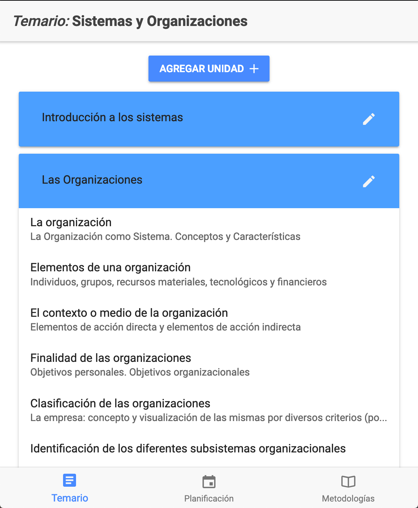
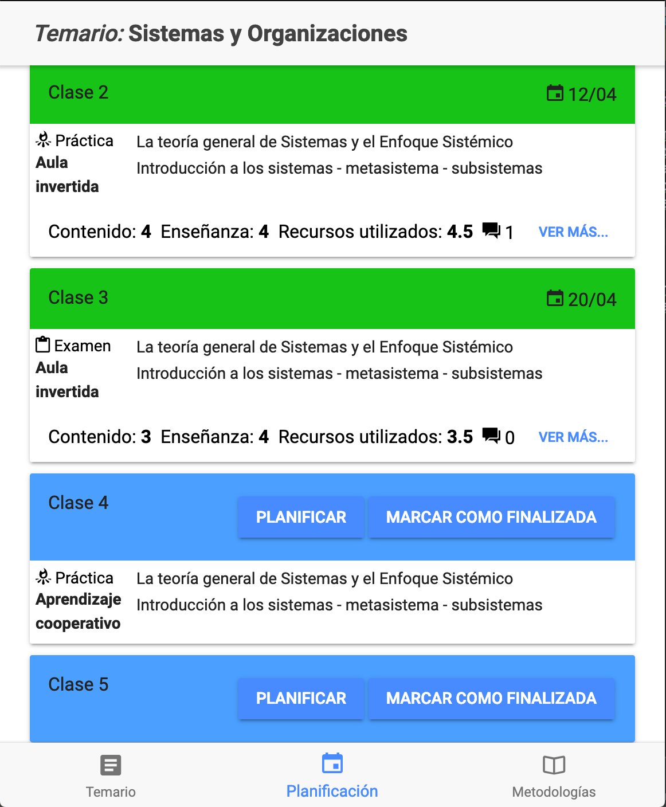
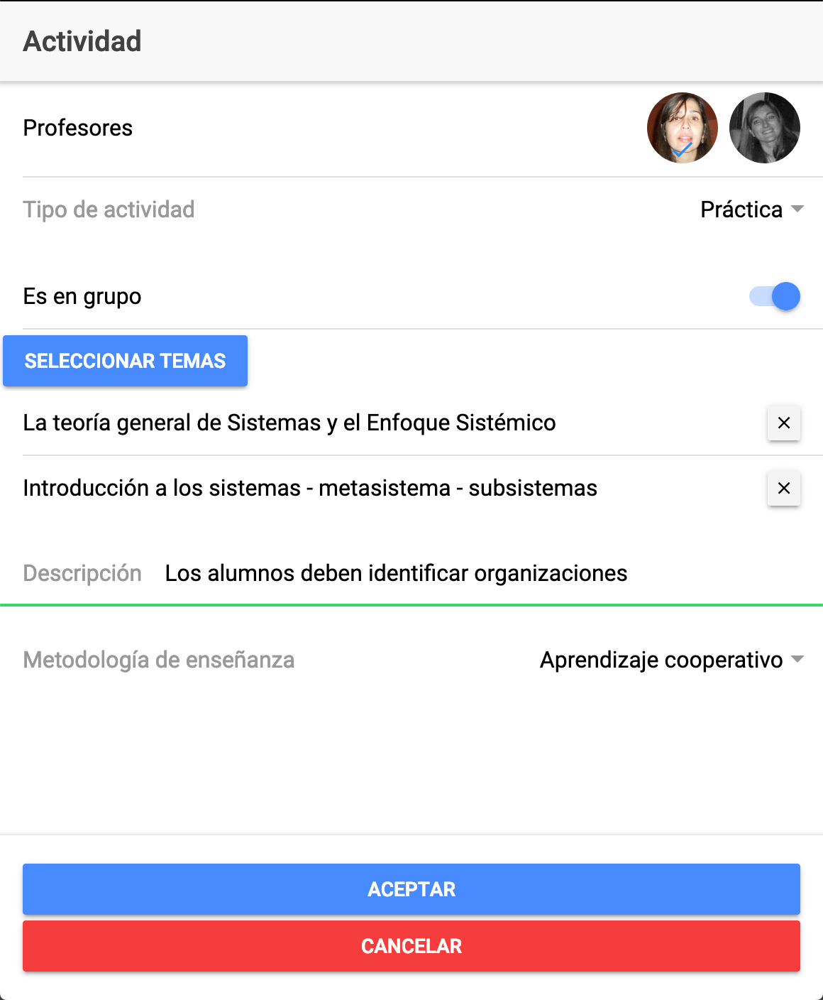

#Sistema para medir la calidad educativa

Los objetivos de este sistema son:
* Los docentes podrán calendarizar todas las clases con sus respectivas actividades
* Realizar encuestas clase a clase a los alumnos para brindar una retroalimentación semanal a los docentes
* Brindar a los alumnos información acerca de cuándo se darán los distintos temas de las cátedras (y que puedan activar notificaciones sobre las mismas)
* Brindar estadísticas sobre los mejores docentes mensuales y poder ver un ranking de los cinco mejores
* Los alumnos recibirán una notificación con los contenidos de la clase siguiente y en la misma aparecerá contenido útil como: videos explicativos de temas complementarios, breve introducción al tema, recursos necesarios para cada actividad.

 
 

ToDo:
* Al marcar una clase como realizada se tiene que poder editar la misma para indicar si se agregaron o eliminar algunos temas, así como también se podría modificar cualquier otra característica de cada actividad.
* Avanzar sobre las pantallas que verán los alumnos
